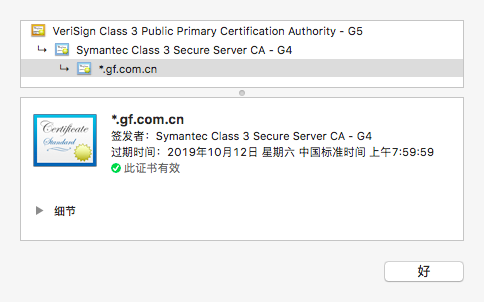

### 对称加密与非对称加密

### 数字签名

密钥除了加／解密报文之外，还可以用来对报文进行签名，以证明谁编写的报文及报文的完整性，这种技术被称为`数字签名`（digital signing）。

数字签名通常通过非对称加密实现，是加了密的校验和，因为只有所有者拥有私钥，所以可以把作者私钥当成一种`“指纹”`。

流程大致如下：
- 发送者提取报文摘要，并对报文摘要应用解码函数 Decrypt。此时解码函数为签名函数，包含私钥信息。
- 将计算出的签名附在报文末尾，发送给接收端。
- 接收端对签名应用公钥的反函数 Encrypt，然后检查报文摘要的完整性。

### 证书颁发机构

验证签名时需要用到网站公钥，但现实中手工保存每个网站的公钥是不可行的。证书颁发机构（CA）可以帮我们做这件事，对公钥和公共 DNS 名称之间的映射进行证实，他们会审计和验证这些站点的证书没有被滥用或冒充。

证书包含 Web 站点的公钥和签发机构的签名，浏览器会对签发机构的签名进行检查（浏览器会预装很多权威机构的证书），验证证书的完整性。

在大多数情况下，CA 并不直接给网络服务器证书签名，通常与一个或多个中间证书组成信任链。中间证书验证站点证书的签名，上级证书再验证中间证书的签名，直至根证书，具体案例如下：

- *.gf.com.cn 证书由 Symantec Class 3 Secure Server CA - G4 签发。
- Symantec Class 3 Secure Server CA - G4 证书由 VeriSign Class 3 Public Primary Certification Authority - G5 签发。
- VeriSign Class 3 Public Primary Certification Authority - G5 是根证书颁发机构。

    

### 疑问

1. _SSL 和 TLS 区别？_

SSL（Secure Sockets Layer，安全套接字层）协议是网景公司专有的，IETF 后来在标准化 SSL 协议时，将其改名为 TLS（Transport Layer Security，传输层安全）。
